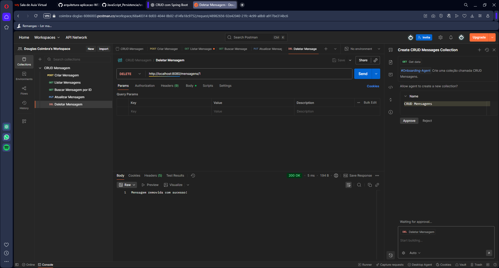

# 📝 CRUD de Mensagens em Memória com Spring Boot

Este projeto é uma aplicação **Spring Boot** que implementa um **CRUD (Create, Read, Update, Delete)** simples para gerenciamento de mensagens, utilizando apenas uma lista em memória como armazenamento.  
Não há banco de dados, e todas as operações são realizadas via **API REST**.

---

## 🚀 Tecnologias Utilizadas
- Java 17+
- Spring Boot (Web, DevTools)
- Maven
- Postman ou Insomnia para testes
- Git/GitHub para versionamento

---

## 📂 Estrutura do Projeto

```
src/main/java/com/exemplo/crudmensagens/
├── controller
│ └── MensagemController.java # Camada responsável pelos endpoints REST
├── model
│ └── Mensagem.java # Classe de modelo (dados da mensagem)
├── service
│ └── MensagemService.java # Camada de lógica de negócio
└── CrudMensagensApplication.java # Classe principal
```

---

## ⚙️ Como Rodar o Projeto

1. **Clonar o repositório**
   ```bash
   git clone https://github.com/CoimbraDouglas/AppWebCRUD_Mensagens.git
   cd AppWebCRUD_Mensagens
   ```

Rodar o projeto
```
./mvnw spring-boot:run
```

A API estará disponível em:
```
http://localhost:8080/mensagens
```

---

📌 Endpoints da API
➕ Criar uma nova mensagem

POST /mensagens

Exemplo de JSON:
```
{
  "texto": "Minha primeira mensagem!"
}
```

Resposta:
```
{
  "id": 1,
  "texto": "Minha primeira mensagem!"
}
```

📋 Listar todas as mensagens

GET /mensagens

Resposta:
```
[
  {
    "id": 1,
    "texto": "Minha primeira mensagem!"
  },
  {
    "id": 2,
    "texto": "Outra mensagem"
  }
]
```

🔍 Buscar mensagem por ID

GET /mensagens/{id}

Exemplo:
```
GET http://localhost:8080/mensagens/1
```

Resposta:
```
{
  "id": 1,
  "texto": "Minha primeira mensagem!"
}
```

✏️ Atualizar mensagem existente
```
PUT /mensagens/{id}
```
Exemplo de JSON:
```
{
  "texto": "Mensagem atualizada com sucesso!"
}
```

Resposta:
```
{
  "id": 1,
  "texto": "Mensagem atualizada com sucesso!"
}
```

❌ Remover mensagem

DELETE /mensagens/{id}

Exemplo:
```
DELETE http://localhost:8080/mensagens/1
```
Resposta:
```
"Mensagem removida com sucesso!"
```

---

🧪 Testando a API

Você pode utilizar o Postman ou Insomnia para testar os endpoints:

POST → Criar mensagens

GET → Listar todas ou buscar por ID

PUT → Atualizar mensagens

DELETE → Remover mensagens

---

📸 Tela do Postman expondo a inserção de dados:



---

📖 Observações

Como os dados estão em memória, ao reiniciar a aplicação todas as mensagens são perdidas.

Este projeto tem caráter didático, para aprendizado de arquitetura MVC com Spring Boot e manipulação de APIs REST, e foi desenvolvido por Douglas Coimbra.
